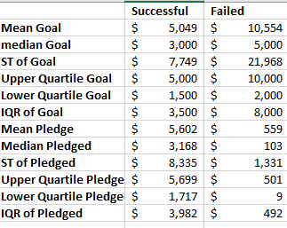
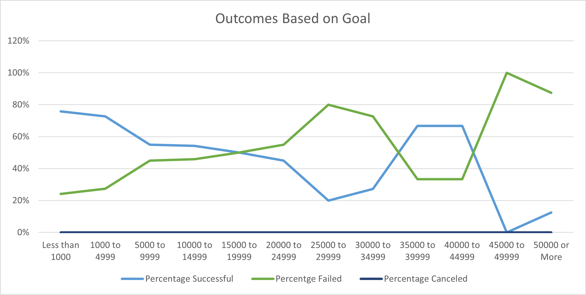

# Kickstarter-Analysis
## Overview of Project
Analysis performed using Kickstarter data to help inform a play organizer as they work towards their funding goal of $10,000.

### Purpose
The purpose of this project is to show how different campaigns fared in relation to their launch dates and their funding goals to help Louise organize, sort, and understand what factors make a successful campaign. Using various analysis to help her understand campaigns start to finish and how to mirror a successful campaign.

## Analysis and Challenges 

### Analysis of Outcomes Based on Launch Date
Knowing which season or month to launch a kick starter may be a deciding factor for Louise. The data shows that the most successful campaigns were launched during late Spring/ early, whereas most unsuccessful campaigns were launched during the winter.
category!Theater_outcomes_vs_Launch]( Theater_Outcomes_vs_Launch.png)

### Analysis of Outcomes Based on Goals
By looking at outcomes based on goals, the data can help Louise visualize if her goal of $10,000 is over ambitious, not enough or just right. The average goal of successful Kickstarters was around $5000. The average goal of failed Kickstarters was around $10,000. 
category

Looking at plays with goals ranging from $5000-$15000, we can see that Louise has the best chances of a successful campaign by lowering her goal to $5000 (73%) 
category

### Challenges and Difficulties Encountered
-When performing analysis for outcome based on goals for plays it showed that there were 0 canceled plays across all goal range brackets. I was hesitant and began to second guess my code, but after further investigation there were in fact no plays that were canceled, only successful and failed.

## Results
- Kickstarters launched in May/June have been more successful than those in December-February. Louise should consider launching her play in mid Spring or early Summer.
- Plays with more ambitious goals were most likely to fail. 80% of plays with a goal of $40,000 failed. 
-Louise should consider lowering her fundraising goal as most successful plays had goal of less than $4,500.
- Some limitations of the data set are that there were live data points included during analysis; this was an issue as we could not determine outcome.
- Some interesting topics to consider would be length of campaign, country of campaign, or length of time by average donation.
